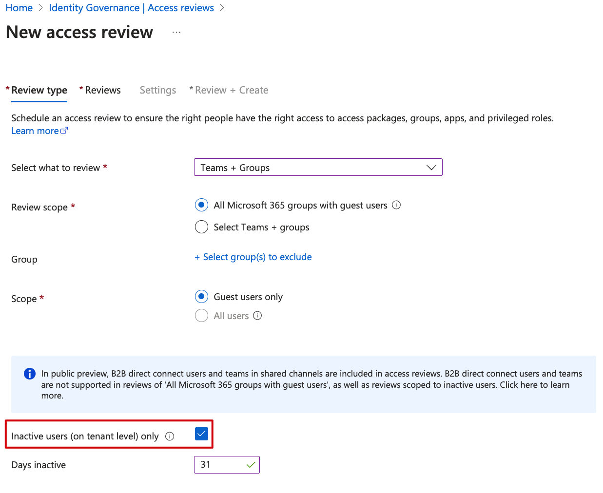

# Review and remove AAD inactive guest users
[Announced at Microsoft Build 2022](https://techcommunity.microsoft.com/t5/microsoft-entra-azure-ad-blog/review-and-remove-aad-inactive-users-in-public-preview/ba-p/3290632#:~:text=The%20public%20preview%20of%20access%20reviews%20for%20inactive%20users%20enables,covered%20under%20sign%2Din%20activity) Microsoft implemented additional features to the Identity Governance suite that let administrators review and remove stale accounts that have not signed in for a certain number of days. This, in turn, improves your organization's security posture.

> Note: This feature was still in public preview when I tested it, so my results and outcomes may differ depending on the state the tool is in at the time of publishing.

## Prerequisites
Azure AD Premium P2.
- A global administrator, user administrator, or identity governance administrator creates reviews on groups or applications.
Global administrators and privileging role administrators can create reviews on role-assignable groups. For more information, see Use Azure AD groups to manage role assignments.
Microsoft 365 and Security group owner

## Implementation
Create a new access review and select `Teams + Groups`, with `Guest users only` as the Scope.

At the next tab, you are presented with a host of different options, for example reviewers, duration and what happens when the review period is over. For my test, I choose `Auto apply results to resource` and let Azure AD take recommendations for me. If you are wondering, recommendations could mean to deny or approve the user's continued access. Note the reviewer decision helper checkbox I left checked.

### Trial run Guest accounts:

## Results

The access review was completed on September 1, 2022. There were 212 groups that were included in the scope and matched the criteria of this
review. After the review period was completed, the decision was made to `take recommendations` as per the screenshots above. The result was that
multiple users that used their access lost their access to the Microsoft 365 Groups, as reported by the customer some days later.

> The reason why this happened was that the access review seems to differentiate between interactive and non-interactive sign-ins in AAD. The interactive
Sign-ins appear to be the only metric the access review checks when enforcing its logic.

[As per the documentation](https://learn.microsoft.com/en-us/azure/active-directory/governance/create-access-review#next-settings), if you select No sign-in within 30 days, users who have signed in during the previous 30-day period are recommended for approval. Users who haven't signed in during the past 30 days are recommended for denial. This 30-day interval is irrespective of whether the sign-ins were interactive or not.

This decision-helper was enabled as per the screenshots in the beginning, so it shouldn't have recommended the guests be removed.

For this example guest user, the account was created on **June 21, 2022**, but it says in AAD that the last sign-in was **January 1, 2001.**

We can see from the screenshots that the same user has had multiple successful sign-ins (non-interactive) in the past month.

## Outcome

I decided to revert the actions the access review made and put all the group memberships (manually) back the way they were before. However, I believe the tool is an excellent addition to the already packed feature set of Identity Governance in Azure AD. The functionality might have changed/improved since I wrote this post. As with anything in public preview, run at your own risk. My suggestion would be to run it with the `Auto apply results to resource` checkbox turned off to only get an Audit first.