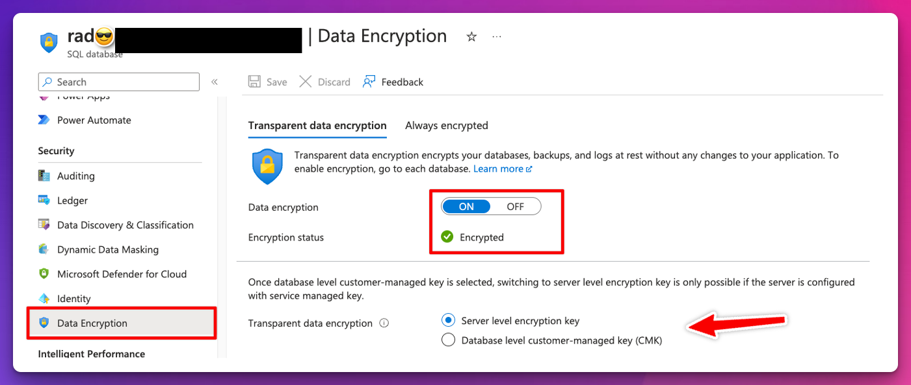
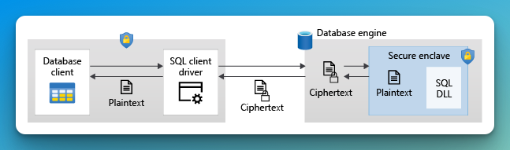
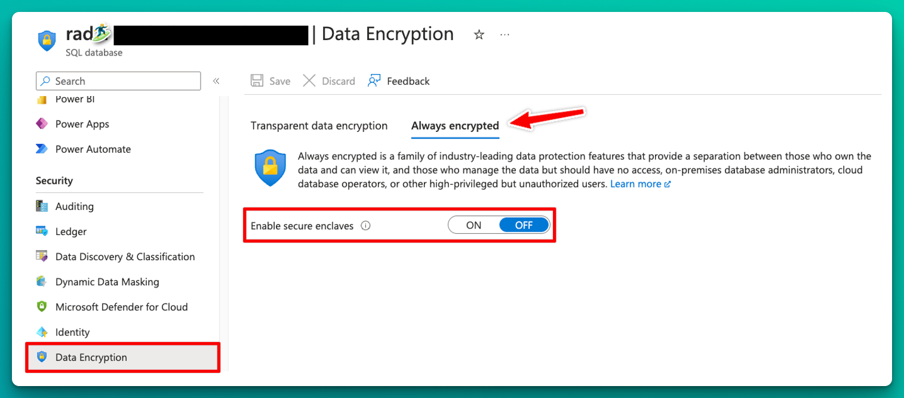
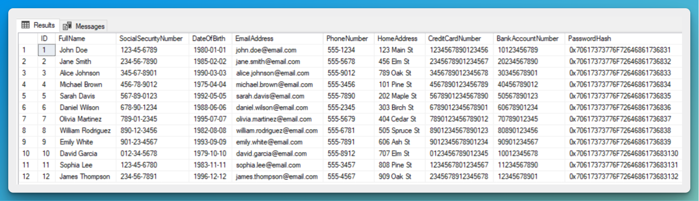
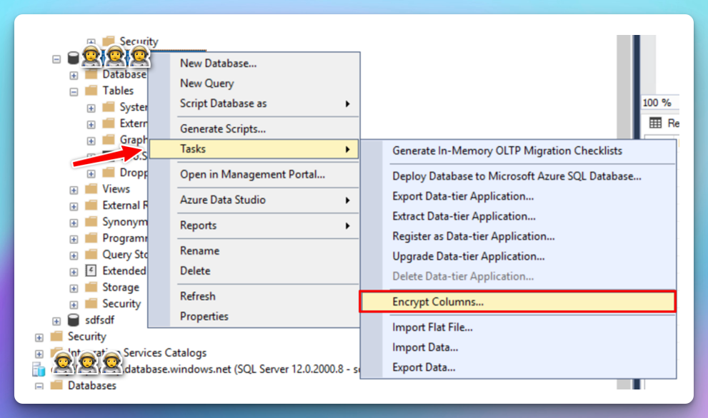
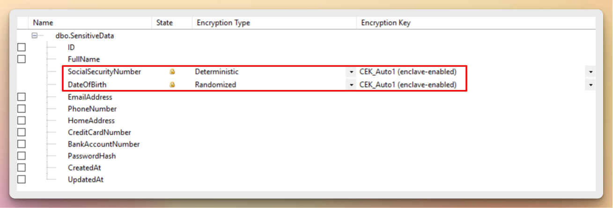
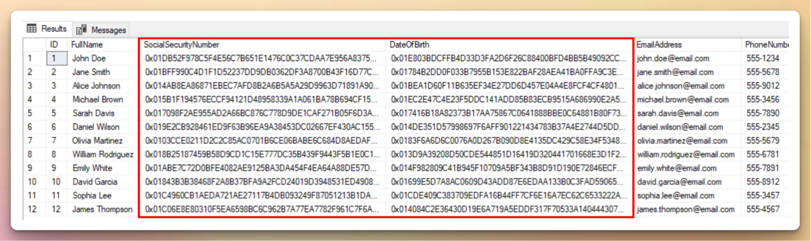
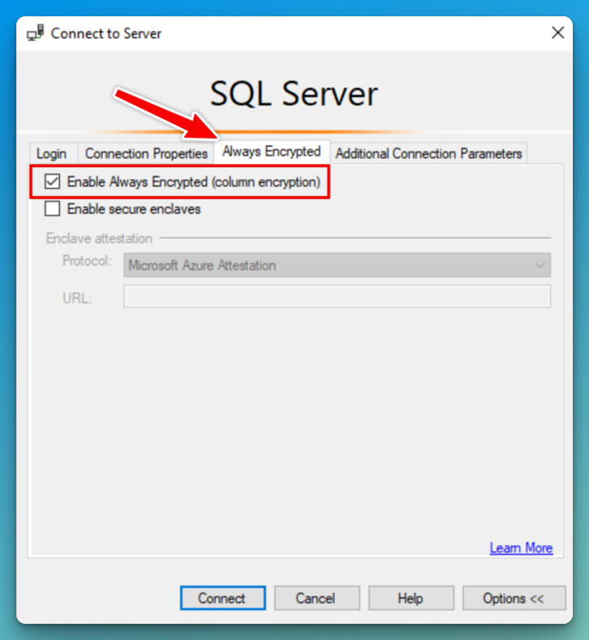
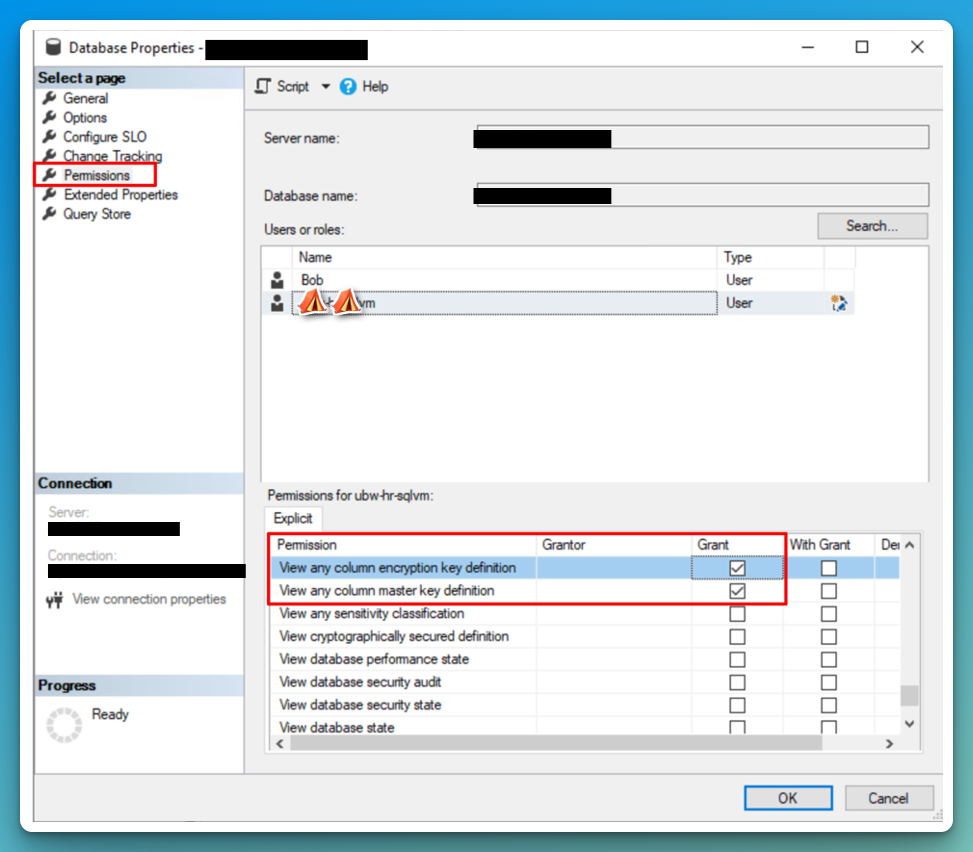
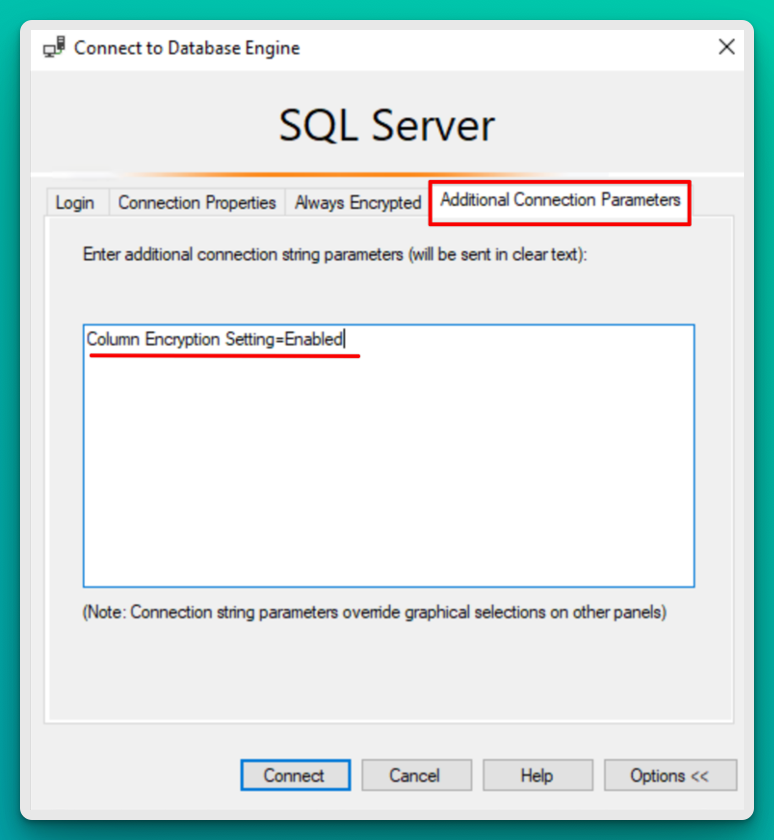

# Encryption

When determining the need for encryption, assess how users interact with data. Encryption may be essential for enhancing security when data is accessed via a public network. Additionally, encryption should also be considered in cases where access is limited to a secure intranet setup, as internal threats exist. In all cases, implementing encryption should be accompanied by a plan for maintaining passwords, keys, and certificates.

## Transparent Data Encryption (TDE)

Transparent data encryption encrypts your data at rest without any changes to your application. This is enabled by default for all databases created after May 2017 and SQL Managed Instance databases created after February 2019. TDE is not used to encrypt system databases like the _master_ database. To see if you have TDE enabled or enable it, look at the security settings for the database and select Data Encryption.

Note that we can choose between server-level encryption key and CMK encryption. The former reduces administrative effort and allows Azure to generate a key and manage key rotations for you. CMK allows you to use your own key stored in an Azure Key Vault or Managed HSM (Hardware Security Module).

## Always Encrypted

So, while TDE is on and ensures encryption for DBs, backups, and logs, it does not take into consideration your most sensitive data. Always encrypted with secure enclaves makes it impossible to query and process the protected data in the cloud. It uses client-side encryption with keys that are never visible to the database engine. This means that we can prevent a high-privileged user account with existing access to the database from performing certain operations on specific tables and columns for which they are unauthorized. Azure offers two options to enable this, hardware-based SGX and virtualization-based VBS. This feature is available at no additional cost.

 

### Intel Software Guard eXtensions (SGX)

Hardware-based execution-based environment technology. This feature is only available for DC-series _vCore-based_ SQL Databases, which are more costly. If you want to use other SKUs, see the VBS section. It is also available for SQL Server 2019 and later.

If you want to use this kind of encryption, consider if it’s the right use case for your business, as well as the cost/benefit of paying for premium SKU that supports this kind of hardware encryption.

SGX requires you to create and manage an attestation provider and an attestation policy, in which Microsoft recommends having role separations assumed by different people where the responsibilities are divided, such as one role to handle the attestation, one to be DBA and one for applications that will access the sensitive data.[^2] This follows zero trust model. If you want to reduce the attack surface for sensitive data, you shouldn’t have a single DBA to handle each role.

[^2]: https://learn.microsoft.com/en-us/azure/azure-sql/database/always-encrypted-enclaves-plan?view=azuresql#roles-and-responsibilities-when-configuring-intel-sgx-enclaves-and-attestation

### Virtualization-based Security (VBS)

Virtualization-based Security (VBS) was first included in Windows 10 and Windows Server 2016 by default. Utilizing Microsoft Hyper-V virtualization technology, VBS effectively isolates specific processes from the operating system. Consequently, information can only be decrypted and processed within the enclave, providing a robust layer of security.

VBS enclaves are highly recommended for customers who need to protect data in use, particularly from high-privileged users within their organization, including Database Administrators (DBAs).[^3] 

With VBS, even if a DBA has high-level access to the system, they cannot access the data in plaintext without the necessary cryptographic keys. This setup ensures that sensitive data remains secure and inaccessible to unauthorized personnel.

[^3]: https://learn.microsoft.com/en-us/azure/azure-sql/database/always-encrypted-enclaves-plan?view=azuresql#vbs-enclaves

A critical distinction between VBS and technologies like Intel's SGX is that VBS provides protection against attacks at the guest OS level, although it does not extend this protection to the host OS. In the context of SQL Database, which is a managed PaaS solution, the responsibility for security and trust is primarily on Microsoft. This reliance means that users entrust Microsoft not only with managing the database infrastructure but also with ensuring the security of their data within the platform. Microsoft ensures that the Hyper-V technology and the VBS feature are continually updated to address new security threats and vulnerabilities.

VBS enclaves are not enabled by default and need to be enabled manually, as the screenshot below shows.

This can only be enabled on the DB level so one can choose which databases will be encrypted using secure enclaves.

Let’s fill in our database with generated sensitive info and see what happens when accessing encrypted data. I'm using the  from Microsoft. First, we need to select which columns are going to be encrypted. This can be done either using SQL queries or selecting them from SSMS.

You can launch the wizard at three different levels[^4]:

1. At a database level - if you want to encrypt multiple columns located in different tables.
2. At a table level - if you want to encrypt multiple columns located in the same table.
3. At a column level - if you want to encrypt one specific column.

[^4]: https://learn.microsoft.com/en-us/sql/relational-databases/security/encryption/always-encrypted-wizard?view=sql-server-ver16#open-the-always-encrypted-wizard

**To encrypt**:

 Right-click your database, point to Tasks, and then select Encrypt Columns.

Running the `SELECT` statement again after encryption should give you the same columns in binary ciphertext.

To see the decrypted values, connect to the database using Always Encrypted option in the connection view.

## Dynamic Data Masking
I wanted to add this section as well, as these two technologies seem quite similar from the outside. Dynamic Data Masking is used to mask sensitive data to non-privileged users. It hides the data instead of encrypting it like we saw in the binary example above.  
> For example, a social security number 123-45-6789 can be masked to show as XXX-XX-6789 to unauthorized users.

DDM provides a layer of security that disallows unauthorized users to show sensitive data, but it does not provide encryption on the data itself. It has the benefit of lower performance overhead as the masking only happens when the data is being displayed.  

DDM Rules can be set up directly in the Azure portal or through T-SQL commands without changes to the application code.

## **Troubleshooting**

If you aren’t able to see the decrypted columns, make sure you have **VIEW ANY COLUMN MASTER KEY DEFINITION** and **VIEW ANY COLUMN ENCRYPTION KEY DEFINITION** permissions on the DB properties. In SSMS you might also need to add `Column Encryption Setting=Enabled` to the Additional Connection Parameters Tab.

