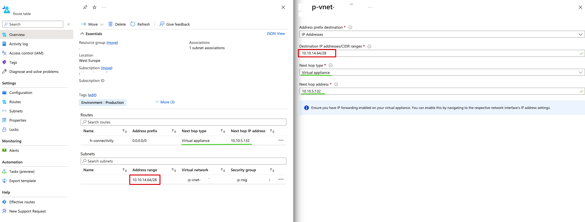
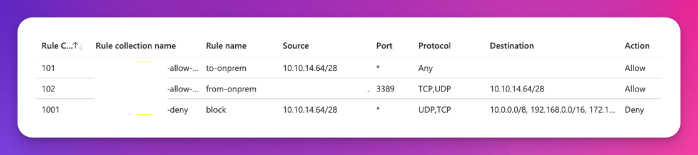
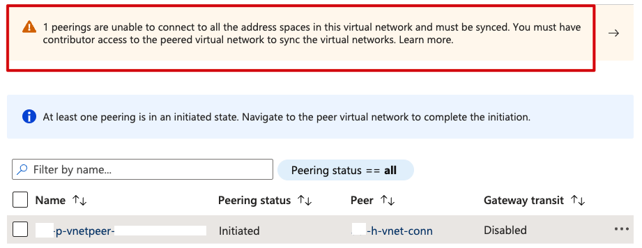
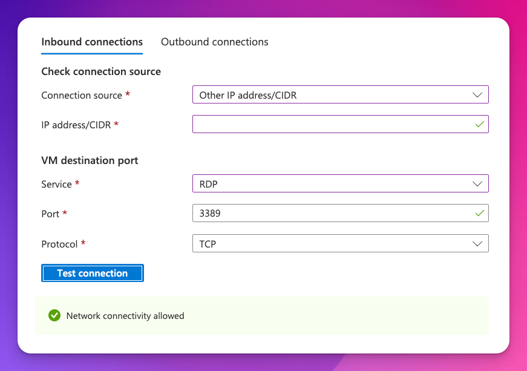
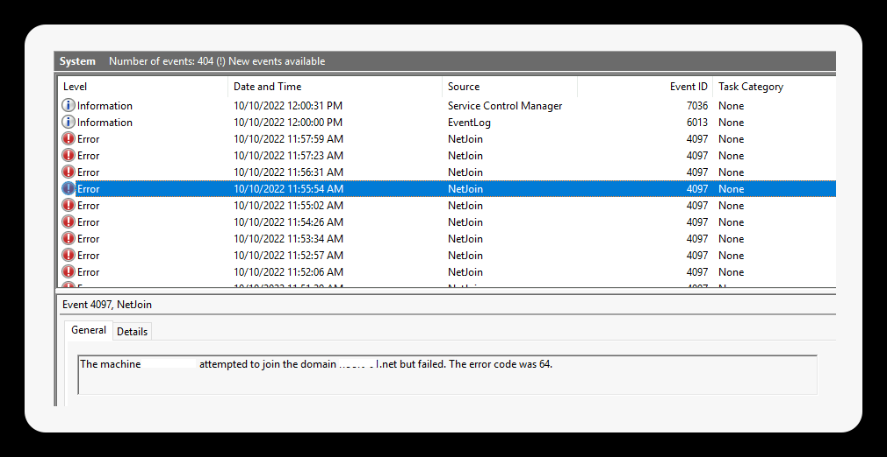
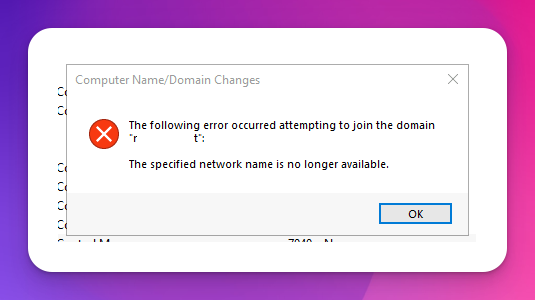

To start off, we are going to use the `JsonADDomainExtension` for Terraform which is going to join our AD domain automatically by using the Azure VM extension.

```terraform
resource "azurerm_virtual_machine_extension" "vm_adjoin" {
  name                 = "vm-adjoin"
  virtual_machine_id   = azurerm_windows_virtual_machine.vm.id
  publisher            = "Microsoft.Compute"
  type                 = "JsonADDomainExtension"
  type_handler_version = "1.3"

  settings = <<SETTINGS
    {
        "Name": "yourdomain.net",
        "OUPath": "OU=Servers,OU=Resources,DC=yourdomain,DC=net",
        "User": "admin@yourdomain.net",
        "Restart": "true",
        "Options": "3"
    }
  SETTINGS

  protected_settings = <<PROTECTED_SETTINGS
    {
        "Password": "${data.azurerm_key_vault_secret.adjoin.value}"
    }
  PROTECTED_SETTINGS

```
## Error code 1355 / Event log event ID 4097 error 64
Output from the VM extension tab in Azure Portal
```console
[
    {
        "code": "ComponentStatus/JoinDomainException for Option 3 meaning 'User Specified'/failed/1",
        "level": "Error",
        "displayStatus": "Provisioning failed",
        "message": "ERROR - Failed to join domain='xxx.net', ou='OU=Servers,OU=Machines,DC=xxx,DC=net', user='adjoin@xxx.net', option='NetSetupJoinDomain, NetSetupAcctCreate' (#3 meaning 'User Specified'). Error code 1355"
    },
    {
        "code": "ComponentStatus/JoinDomainException for Option 1 meaning 'User Specified without NetSetupAcctCreate'/failed/1",
        "level": "Error",
        "displayStatus": "Provisioning failed",
        "message": "ERROR - Failed to join domain='xxx.net', ou='OU=TestServers,OU=Machines,DC=xxx,DC=net', user='adjoin@xxx.net', option='NetSetupJoinDomain' (#1 meaning 'User Specified without NetSetupAcctCreate'). Error code 1355"
    }
]
```

## Terraform apply error: VMExtensionProvisioningError
```console
 Error: Code="VMExtensionProvisioningError" Message="VM has reported a failure when processing extension 'p-vm-adjoin'. Error message: \"Exception(s) occured while joining Domain 'xxx-01.net'\"\r\n\r\nMore information on troubleshooting is available at https://aka.ms/vmextensionwindowstroubleshoot "
│ 
│   with azurerm_virtual_machine_extension.p_vm_adjoin,
│   on prod.tf line 204, in resource "azurerm_virtual_machine_extension" "p_vm_adjoin":
│  204: resource "azurerm_virtual_machine_extension" "p_vm_adjoin" {
```


## Closely check the following:

### Azure Route tables
All hub-spoke VNETs need a pair of route tables going to the central FW. Check that both are set up correctly.


 
### Azure FW Rules
The VNET/subnet needs to be able to connect to the on-prem DCs for joining the domain. Make sure that the rules are set up correctly:
 


### VNET Peering
Check that both the Hub + Spoke VNETs have their individual peering in place. If you get an error message like this, it means that the peering is not working:

 

## Additional troubleshooting
Windows domain joining requires the following ports to be opened. Check from the VM or using built-in azure tools.

|Client Port(s)|Server Port|Service|
|:----|:----|:----|
|1024-65535/TCP|135/TCP|RPC Endpoint Mapper|
|1024-65535/TCP|1024-65535/TCP|RPC for LSA, SAM, NetLogon (*)|
|1024-65535/TCP/UDP|389/TCP/UDP|LDAP|
|1024-65535/TCP|636/TCP|LDAP SSL|
|1024-65535/TCP|3268/TCP|LDAP GC|
|1024-65535/TCP|3269/TCP|LDAP GC SSL|
|53,1024-65535/TCP/UDP|53/TCP/UDP|DNS|
|1024-65535/TCP/UDP|88/TCP/UDP|Kerberos|
|1024-65535/TCP|445/TCP|SMB|
|1024-65535/TCP|1024-65535/TCP|FRS RPC (*)|

> PS: Connection troubleshoot is a good tool.

 
## AD Join manually to test
If the above points has been verified, the AD join should work as expected, but if not you might want to try joining the domain manually from the VM to troubleshoot.
Domain join logs are best read from the stored location in Windows VMs:

` %windir%\debug\Netsetup.log ` 

Event log:
Error 64 event ID 4097
 


### Manually testing joining the domain:
 

Error: `The specified network name is no longer available`

## Resolution
> In this case, it was missing a route table back from the hub that caused the packets to not come back to the VM. It was fixed by creating the missing route in the hub UDRs.
