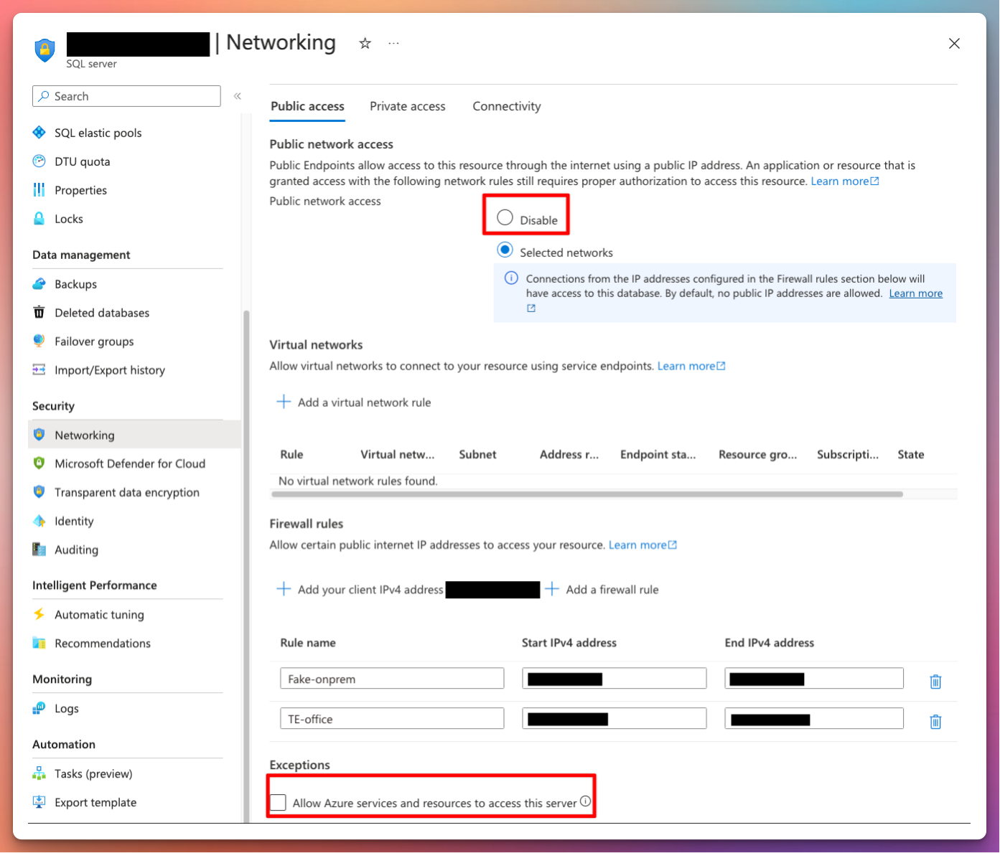
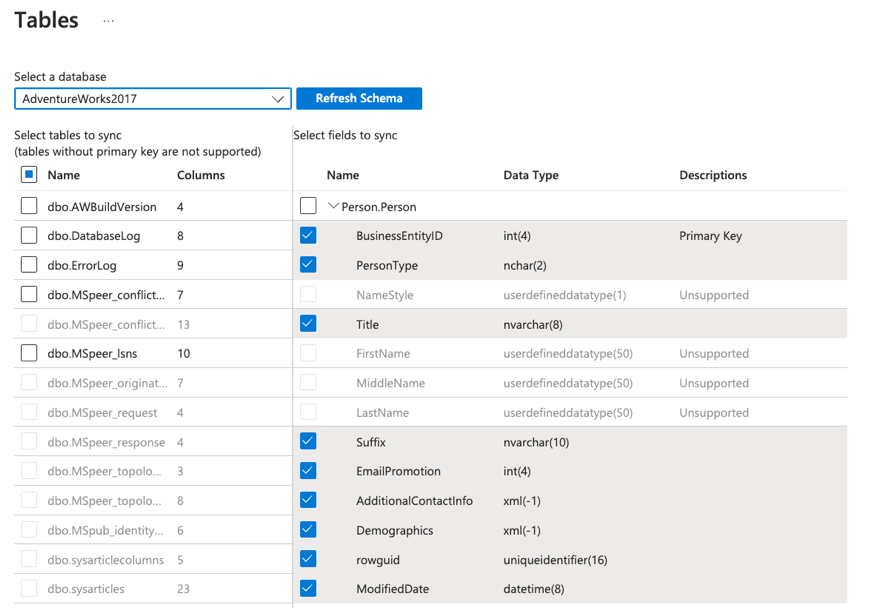

# Data Transport

The process of transferring data from an on-premises SQL server to an Azure SQL server is a critical task for organizations looking to leverage the power and scalability of the cloud. In this blog post, we will explore the ins and outs of data transfer, focusing on the secure and efficient replication of SQL transactions.

## Dependencies

For securing the traffic when replicating SQL transactions, you would need the following:

- A source and destination SQL server
- An Azure tenant with sufficient permissions to deploy and change resources.
- Optional VPN to route the traffic to and from.  
- Access to DNS forwarders and AD Domain controllers if using.

## Standard Replication

For one-way directional database replication from on-premises to Azure, one can configure the source server to become a distributor and in extension act as a publisher for its own data. The *subscriber* will be the server that will receive the data, in this case a Microsoft Azure SQL Server, and there’s different types of replications to choose from when going this route. 

Before enabling replication, you need to decide with _type_ of replication you need based on your different requirements. The available types are described in the table below. As an example ***snapshot replication*** would seem to be a good fit if the data doesn’t need to be the absolute latest version. In this post we are using ***transactional replication*** as it is a good starting ground, as you can more or less guarantee transactional consistency. This type of replication will also work when the publisher or subscriber is a non-SQL database, such as Oracle. 

The decision of which replication type you need should be based on the frequency of updates and changes to the source, as well as what happens afterwards in terms of transformation of the data, like being used in Azure Data Factory or exported to PowerBI.

### Types of replication[^1]
| **Type**                 | **Description** |
| :-------------------------------- | :-------------- |
| [Transactional replication](https://learn.microsoft.com/en-us/sql/relational-databases/replication/transactional/transactional-replication?view=sql-server-2016) | Changes at the Publisher are delivered to the Subscriber as they occur (in near real time). The data changes are applied to the Subscriber in the same order and within the same transaction boundaries as they occurred on the publisher. |
| [Merge replication](https://learn.microsoft.com/en-us/sql/relational-databases/replication/merge/merge-replication?view=sql-server-2016) | Data can be changed on both the Publisher and Subscriber, and are tracked with triggers. The Subscriber synchronizes with the Publisher when connected to the network and exchanges all rows that have changed between the Publisher and Subscriber since the last time synchronization occurred. |
| [Snapshot replication](https://learn.microsoft.com/en-us/sql/relational-databases/replication/snapshot/snapshot-replication?view=sql-server-2016) | Applies a snapshot from the Publisher to the Subscriber, which distributes data exactly as it appears at a specific moment in time, and does not monitor for updates to the data. When synchronization occurs, the entire snapshot is generated and sent to Subscribers. |
| [Peer-to-peer](https://learn.microsoft.com/en-us/sql/relational-databases/replication/transactional/peer-to-peer-transactional-replication?view=sql-server-2016) | Built on the foundation of transactional replication, peer-to-peer replication propagates transactionally consistent changes in near real-time between multiple server instances. |
| [Bidirectional](https://learn.microsoft.com/en-us/sql/relational-databases/replication/transactional/bidirectional-transactional-replication?view=sql-server-2016) | Bidirectional transactional replication is a specific transactional replication topology that allows two servers to exchange changes with each other: each server publishes data and then subscribes to a publication with the same data from the other server. |
| [Updatable Subscriptions](https://learn.microsoft.com/en-us/sql/relational-databases/replication/transactional/updatable-subscriptions-for-transactional-replication?view=sql-server-2016) | Built on the foundation of transactional replication, when data is updated at a Subscriber for an updatable subscription, it is first propagated to the Publisher and then propagated to other Subscribers. |

### Setup guides for replication

Setting up SQL Server replication involves several steps, and Microsoft provides guides that walk you through the entire process, ensuring you don't miss any critical steps. I won't reiterate them here.

Please follow the guides as directed if applicable:
#### Server Preparation
The [Preparing the Server for Replication](https://learn.microsoft.com/en-us/sql/relational-databases/replication/tutorial-preparing-the-server-for-replication?view=sql-server-ver16) tutorial is an excellent starting point. It covers everything from the basics to more advanced preparation steps. Follow this guide carefully to avoid common pitfalls.

>📣 Personal Tip: Always ensure your server meets the prerequisites outlined in the guides before starting. Skipping these steps can lead to complications down the line.

#### Configure Transactional Replication
Once your server is prepped, you'll move on to configuring transactional replication. This is where the [Replicating Data Between Continuously Connected Servers](https://learn.microsoft.com/en-us/sql/relational-databases/replication/tutorial-replicating-data-between-continuously-connected-servers?view=sql-server-ver16) guide comes into play. It provides a step-by-step walkthrough of setting up transactional replication, ensuring data consistency and integrity across your servers. This guide is crucial for understanding the nuances of transactional replication and getting it right the first time.

> I'm using an Azure SQL Server on Azure Windows Virtual Machines as my *on-premises* VM for this guide, set up with the guides from above ☝️ 

### Azure Networking
The end goal is to have all traffic go through the backbone networks of Microsoft. We should also be aware of the ``Allow Azure services and resources to access the server`` which essentially opens up the internal SQL Firewall to *any* kinds of Azure resources regardless of location and ownership. 

#### Private Endpoints
To start, we can create the private endpoint which will serve us an internal IP where we will direct all our traffic to after the setup has been completed.

#### DNS Settings
The private endpoint has an internal IP of 192.168.40.4

When creating the Private Endpoint, it will ask you to configure the new Private DNS Zones with it. It will also link the VNET which the Private Endpoint will be created in into this DNS Zone. Essentially it means that the VNETs linked will be able to lookup the records inside.

From the private endpoint view:

> Take note that the visible FQDN and private link FQDN is not the same. This is important when setting up DNS forwarding later. 

If we try to reach this public server name from the “on-premises” SQL Server, we will only get the azure communication channel virtual IP of [168.63.129.16](https://learn.microsoft.com/en-us/azure/virtual-network/what-is-ip-address-168-63-129-16) in response. 

Let’s look at the Private DNS Zone which has been set up when deploying the Private Endpoint:

Verify that all the VNETs that should be able to resolve the private endpoint FQDNs are linked in this zone:

In **Windows DNS Server**, you would set up a conditional forwarder that points to the same FQDN as the Azure Private DNS Zone. In this guide we’re using the Windows hosts file (*C:\Windows\System32\drivers\etc*) for simplification, we can add this FQDN Manually:

If we then try to resolve the SQL server from our “onprem” VM, after editing our hosts file, it should now be able to resolve the address. Notice that the FQDN without “privatelink” in its name is automatically an alias for the resource. Azure creates a canonical name DNS record (CNAME) on the public DNS. The CNAME record redirects the resolution to the private domain name.[^2]

#### Network configuration
The final step now is to verify the SQL connection between the SQL servers. Even though the DNS is resolving, we are not able to reach the SQL Server from SQL management studio:

The reason for this, is because the source “onprem” SQL Server VNET isn’t peered with the destination SQL Server in Azure. Let’s add this.

From the VNET blade in Azure Portal:

**Virtual Network ➡ Settings ➡ Peerings ➡ + Add**

Verify that the 1433 port is open between the SQL servers:

> Note: When the source SQL Server is connected using other forms of network connectivity like VPN or ExpressRoute, the setup would be similar, but you would instead peer the Virtual Network Gateway VNET into the destination SQL VNET or the HUB VNET in a hub-spoke topology.

## SQL Data Sync
Data Sync is another managed sync service that uses a hub and spoke topology to synchronize data. You define one of the databases in the sync group as the hub database. The rest of the databases are member databases. Sync occurs only between the hub and individual members.[^3] 

An important note is that the Hub database must be an Azure SQL Database. If the spoke/member database resides on-oprem, you need to install a local sync agent for this. 

Make sure that you read through the [requirements and limitations](https://learn.microsoft.com/en-us/azure/azure-sql/database/sql-data-sync-data-sql-server-sql-database?view=azuresql#sync-req-lim@)[^4] before setting this up, as the service might not be able to sync all the data that you need.

From the Azure Database view in the portal, select **Sync to other databases** under *Data management*. From there start off by creating a new sync group. Select your metadata database, sync frequency (optional for automatic sync), conflict resolution and username/password for the Hub DB. 

> 📢 NOTE: Entra-only authentication as described in the [previous blog post]() will not work with SQL Data Sync.

After registering the agent, register the database you want to sync to Azure. 

Select the sync group ➡ Databases ➡ Add an On-Premises Database and select the sync agent from the previous step as well as the database and sync directions you want to use (To the hub, from the hub or bi-directional). Select the tables you want to sync and save.

Based on your schedule and direction of the sync, the sync should provision successfully after this.

 

## Comparison between the sync methods[^5]

||**Data Sync**|**Transactional Replication**|
|---|---|---|
|**Advantages**| - Active-active support   - Bi-directional between on-premises and Azure SQL Database   | - Lower latency   - Transactional consistency   - Reuse existing topology after migration   - Azure SQL Managed Instance support |
|**Disadvantages**| - No transactional consistency   - Higher performance impact   - No Entra-only authentication | - Can't publish from Azure SQL Database   - High maintenance cost | 

## Conclusion 
In conclusion, transferring data from an on-premises SQL server database to Azure SQL (PaaS) server is a critical process that requires careful consideration and implementation of secure practices. This blog post has explored various aspects of data transfer, including the types of replication available, setup guides for SQL Server replication, secure networking using private endpoints and DNS settings, and the introduction of SQL Data Sync. By following the guidelines and best practices outlined in this post, organizations can ensure a smooth and secure transfer of data, maintaining data integrity, preventing unauthorized access, and leveraging the power of Azure for data storage and analysis.

[^1]: [https://learn.microsoft.com/en-us/sql/relational-databases/replication/types-of-replication?view=sql-server-ver16 ](https://learn.microsoft.com/en-us/sql/relational-databases/replication/types-of-replication?view=sql-server-ver16)

[^2]: [https://learn.microsoft.com/en-us/azure/private-link/private-endpoint-dns#azure-services-dns-zone-configuration ](https://learn.microsoft.com/en-us/azure/private-link/private-endpoint-dns#azure-services-dns-zone-configuration) 

[^3]: [https://learn.microsoft.com/en-us/azure/azure-sql/database/sql-data-sync-data-sql-server-sql-database?view=azuresql#overview ](https://learn.microsoft.com/en-us/azure/azure-sql/database/sql-data-sync-data-sql-server-sql-database?view=azuresql#overview) 

[^4]: [https://learn.microsoft.com/en-us/azure/azure-sql/database/sql-data-sync-data-sql-server-sql-database?view=azuresql#sync-req-lim ](https://learn.microsoft.com/en-us/azure/azure-sql/database/sql-data-sync-data-sql-server-sql-database?view=azuresql#sync-req-lim) 

[^5]: [https://learn.microsoft.com/en-us/azure/azure-sql/database/sql-data-sync-data-sql-server-sql-database?view=azuresql#compare-with-transactional-replication ](https://learn.microsoft.com/en-us/azure/azure-sql/database/sql-data-sync-data-sql-server-sql-database?view=azuresql#compare-with-transactional-replication)