When it comes to authenticating to Azure SQL server, we are used to authenticating using “basic auth” (SQL Username and password). Although this single factor is not recommended, I still see it very often when working with different clients. 

The main goal: We want to enforce Entra authentication as the only option. 

> Note that this may cause issues with existing permissions, so make sure that your applications support this kind of authentication method, especially third-party applications that you don’t administer yourself. 

# Enabling Entra-Only Authentication

From the SQL Server view in Azure Portal, change the Microsoft Entra ID settings for the server containing the database(s) you want to protect. The “Set admin” button allows you to select either individual users or Entra ID groups. I recommend choosing an Entra ID Group here, as there is built in lifecycle handling if you use the Microsoft Identity Governance suite of services to meet your security and regulatory compliance requirements. You also have the flexibility to add and remove users from the group as needed.

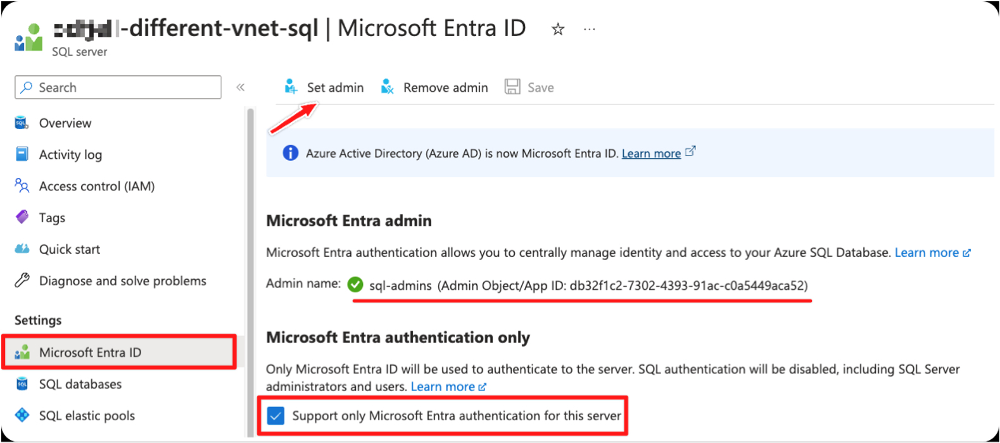

SQL Management Studio error message showing that the changes are active:

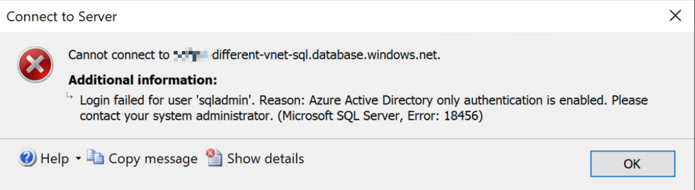

Even though I have enforced Microsoft Entra only authentication for this server, it does not mean that you may only sign in as an Entra User. In this post I want to explore the most likely scenarios that you will run into that will work while adhering to the previous policies.

## Horseman 1: Microsoft Entra MFA
Start off by adding an account to the SQL Admins group that are now the only approved auth group for this server. This can be a guest or member account as long as it exists in Entra ID. 

> Note that the members of this group will get become members of the `db_owner` role in every user database, and enter each user database as the dbo user as well as database user in the `master` system database. In other words, be mindful of the amount of users that actually need this amount of privilege.

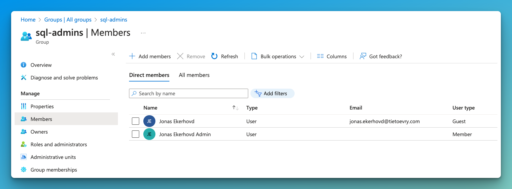

Select Microsoft Entra MFA from SSMS and enter an email that is a part of the SQL Admin group described above.
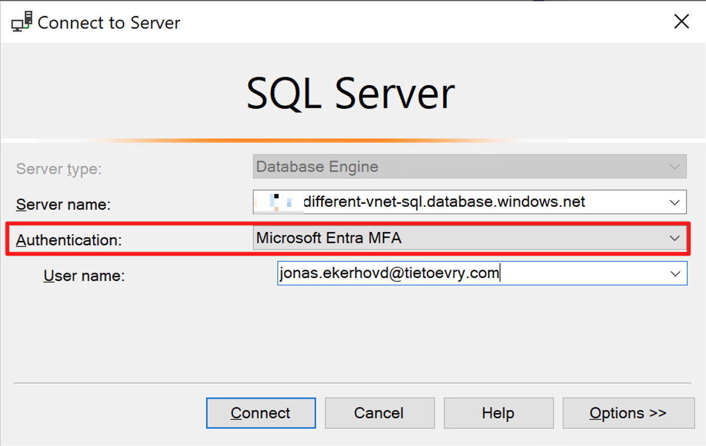

This will open up a browser window and use Microsoft modern authentication with MFA prompt to sign in:

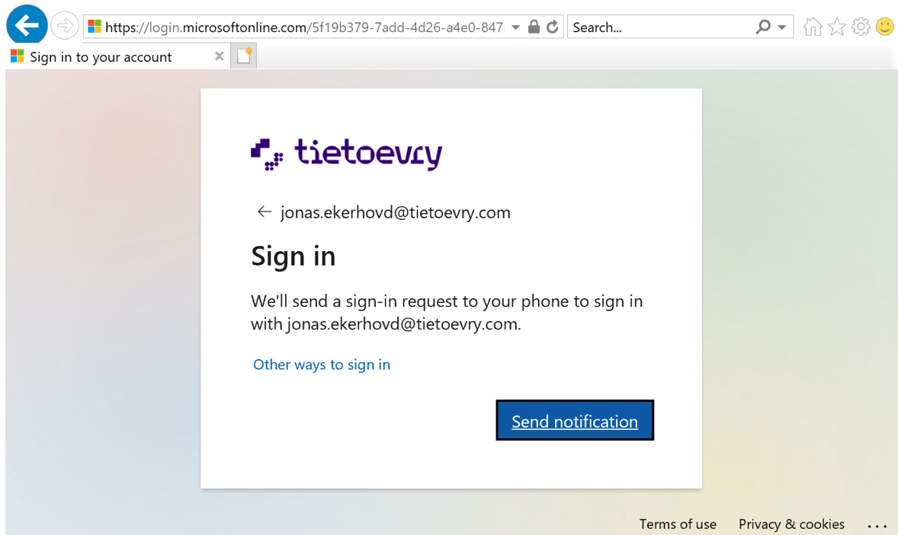

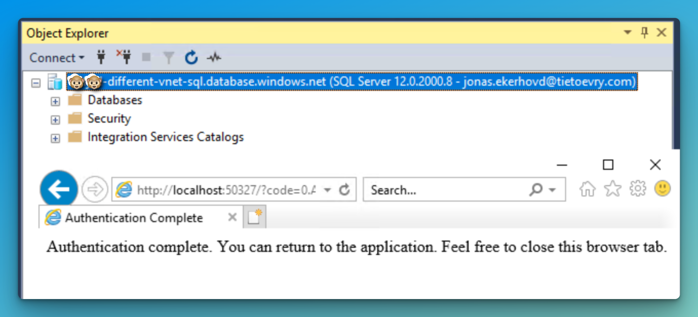

## Horseman 2: Service Principal
Service Principals in Azure are essentially secure authentication identities for automated processes and applications, enabling non-interactive access to Azure resources. Think of them as dedicated accounts for your applications or automation tools, rather than using a personal user's credentials. They're crucial for scripts, CI/CD pipelines, or any application that needs to talk to Azure services without human intervention.

Start by creating a new app registration and add a new client secret for this. The secret can last up to 2 years maximum, so make sure to rotate these on schedule. Note down the App Registration (client) ID and Secret value. 

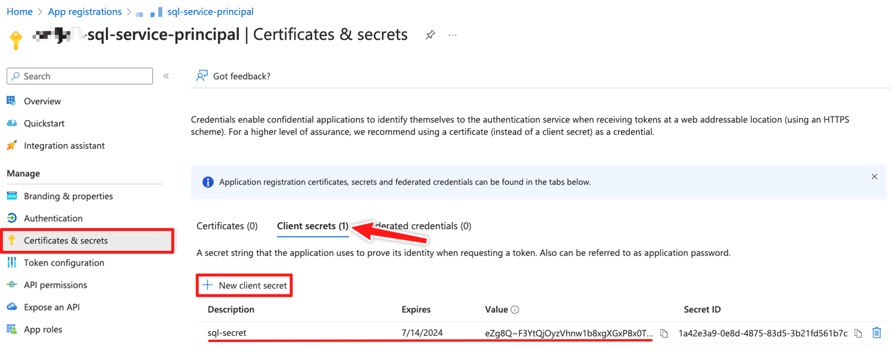

> 💡 Remember, the service principal will also need to be a member of the sql-admins Entra ID group created in the first step. 

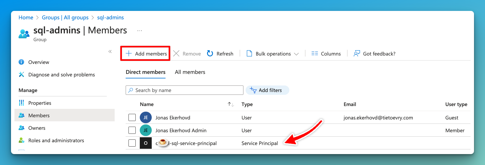

These will be the inputs when accessing our server using this newly created service principal:

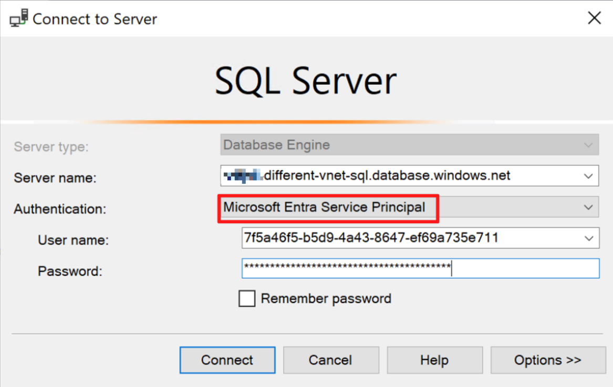

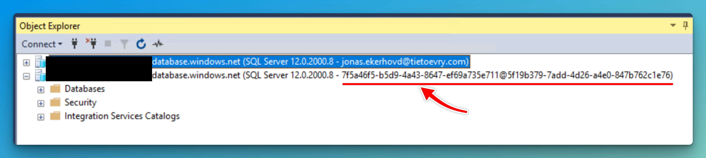

## Horseman 3: Managed Identity (user or system-assigned)
Managed Identities in Azure simplifies how applications authenticate to cloud services, eliminating the need for manual credential management. It automatically provides and manages identities for Azure-hosted applications, allowing secure, straightforward access to Azure services like databases and storage, without the hassle of handling secrets or keys. 

Start by creating a managed identity that will serve as the account that will authenticate to the same server: 

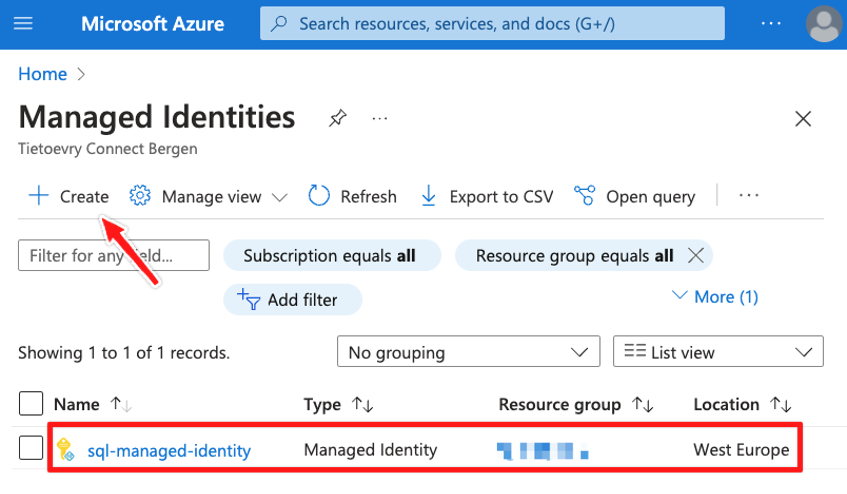

Note down the Client ID for the managed identity.

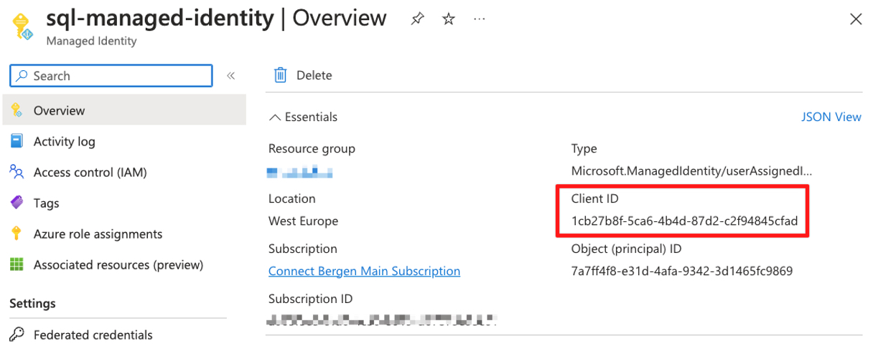

This will be added to the VM, or application that will use the identity to access the SQL server.

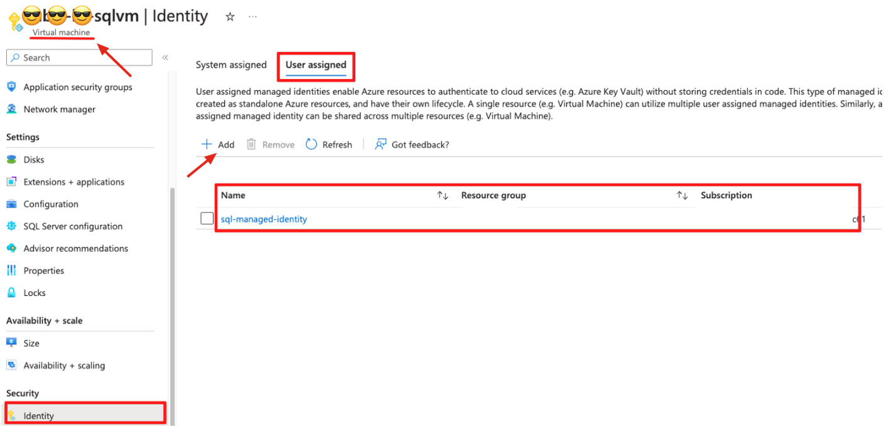

To grant permissions to access Microsoft Graph through an SMI or a UMI, you need to use PowerShell. [You can't grant these permissions by using the Azure portal.](https://learn.microsoft.com/en-us/azure/azure-sql/database/authentication-azure-ad-user-assigned-managed-identity?view=azuresql#permissions )

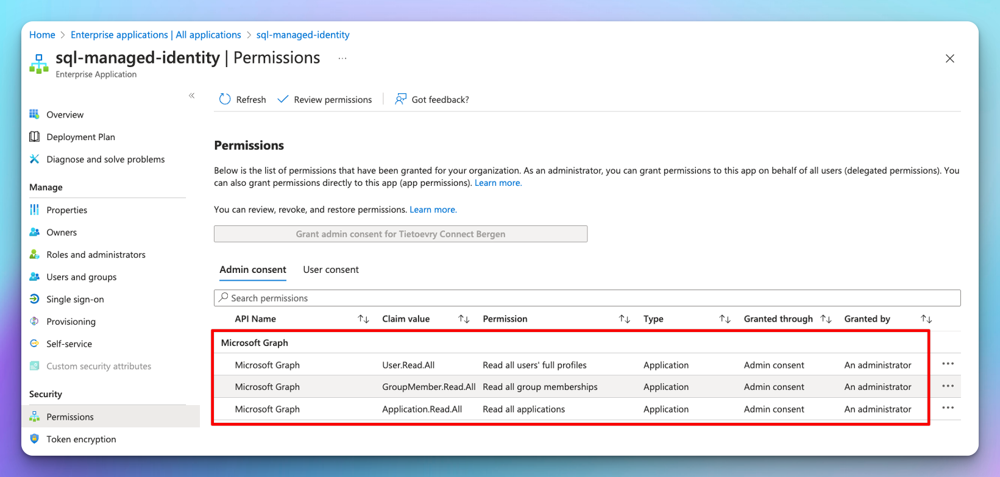

After adding the identity to your application or VM, You will need to create the user inside the database in order to have the roles you intend for this server.

Connect to the server using an existing user or the app registration in the previous step. Use the following query on the actual DB to generate the new login:

```SQL
CREATE USER "sql-managed-identity" FROM EXTERNAL PROVIDER;
ALTER ROLE db_datareader ADD MEMBER "sql-managed-identity";
ALTER ROLE db_datawriter ADD MEMBER "sql-managed-identity";
GO
```
The username is the same name as the managed identity.

Now you should be able to connect to your SQL Server using the Client ID noted down before:

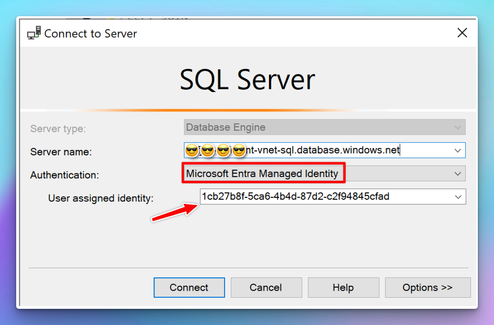

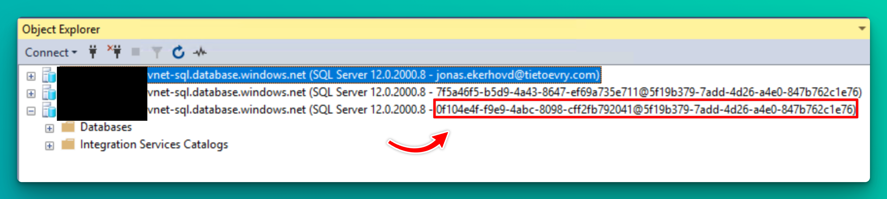

> Note: Depending on the permissions you want the managed identity to have, you will have to type in the database name in the login window, usually not the `master` system database:  

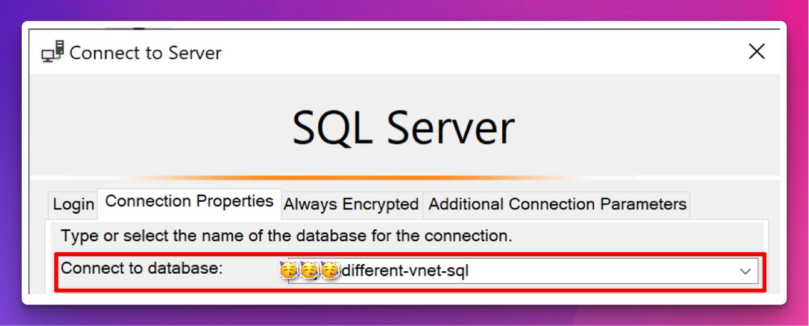

## Horseman 4: Entra ID Service Account (without MFA)
While this method is technically not that different from SQL Basic auth, except for the lifecycle handling and sign-in activity logs you get with built-in native accounts in Entra ID. Adhering to the symbolism and theme of this post of the four horsemen, I wanted to add this for those scenarios that the other options won't meet your needs.

To exclude individual users (such as service accounts) from entering MFA when authenticating, you need to configure this using [Entra ID Conditional Access](https://learn.microsoft.com/en-us/entra/id-governance/conditional-access-exclusion). 

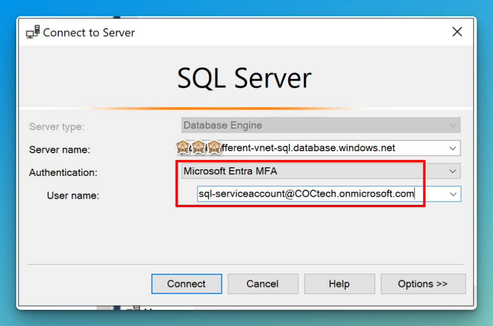

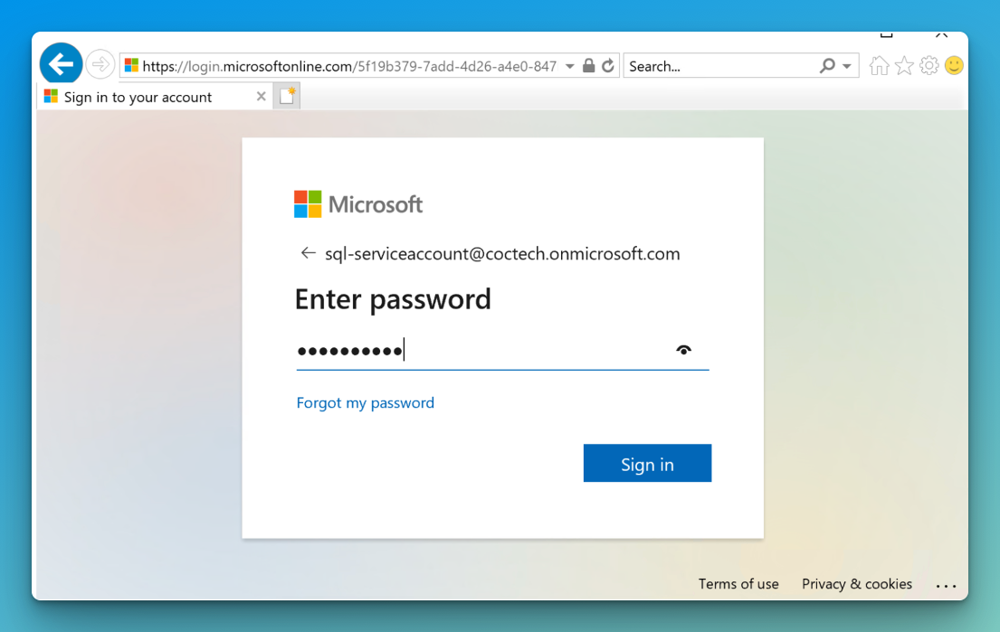

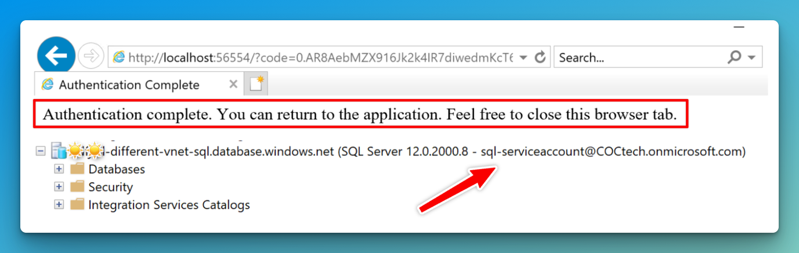
